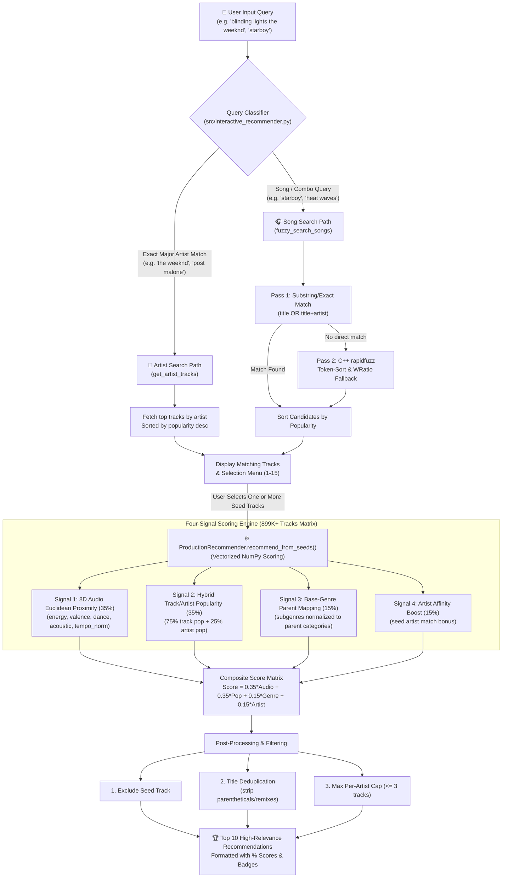

# 🎵 Music Recommender Simulation

## Project Summary

This music recommender system provides personalized, high-performance song recommendations using a hybrid multi-signal scoring model. It evaluates both lightweight CSV catalogs (`data/songs.csv`) and large-scale production datasets (`docs/tracks.parquet` with 1M+ tracks, supporting split parquet files `tracks_part1.parquet` and `tracks_part2.parquet`).

---

## How The System Works

### **Dataset Architecture & Scaling**

* **`data/songs.csv`**: A small, clean 10-song dataset used for local CLI testing, unit tests, and rule-based evaluation.
* **`docs/tracks.parquet`**: A production-grade dataset containing 899,224+ Spotify tracks with full audio feature vectors, release dates, and popularity metrics.
* **Split Parquet Support**: To handle GitHub file size limits, the engine automatically detects and seamlessly joins split parquet files (`tracks_part1.parquet` and `tracks_part2.parquet`) into a unified dataframe if `tracks.parquet` is split into parts.

### **Song Features & User Profile**

This system models songs using **multi-dimensional audio features**:

**Song Attributes:**

- **Genre** (categorical): Subgenre lists normalized to parent categories (`pop`, `rock`, `hip hop`, `r&b`, `edm`, `latin`, `country`, `metal`, `jazz`, `classical`).
- **Mood** (categorical): Emotional context — chill, intense, happy, relaxed.
- **Audio Features** (numerical 8D vector, 0–1 scale):
  - **Energy**: Intensity & activity
  - **Valence**: Musical positivity
  - **Danceability**: Rhythmic rhythm suitability
  - **Acousticness**: Acoustic vs. electronic production
  - **Speechiness**: Spoken word presence
  - **Liveness**: Live performance/audience score
  - **Instrumentalness**: Vocal absence score
  - **Normalized Tempo**: Normalized BPM (50–200 BPM mapped to 0.0–1.0)
- **Popularity**: Hybrid metric combining **75% track-level popularity** and **25% artist popularity** (0–100).

**UserProfile:**

- **Favorite genre** & **favorite mood**: Primary user intent (derived dynamically from seed tracks or entered directly).
- **Audio Centroids**: Average audio feature vector computed across seed tracks (powers "Track Radio" / "Playlist Radio").

### **Finalized Algorithm Recipe (Multi-Signal Composite Scoring)**

For each candidate track, `ProductionRecommender` computes a composite score (0.0 to 1.0) using four weighted signals:

$$
Score = 0.35 \times AudioSimilarity + 0.35 \times HybridPopularity + 0.15 \times GenreSimilarity + 0.15 \times ArtistAffinity
$$

1. **Audio Feature Proximity (35%)**: Calculates Euclidean distance across the 8D audio feature vector (including tempo) normalized to a 0.0–1.0 similarity score.
2. **Hybrid Popularity (35%)**: Blends 75% track popularity + 25% artist popularity to ensure global hit singles (e.g. *Cruel Summer*, *Levitating*, *Shape of You*, *Sunflower*) bubble up above obscure album cuts and background noise.
3. **Genre Similarity (15%)**: Maps subgenres (e.g. `canadian pop`, `dance pop`) to base categories (`pop`). Sharing a base category awards full points, with a bonus for exact subgenre overlaps.
4. **Artist Affinity (15%)**: Boosts tracks by the same artist as the seed.

The interactive CLI offers `similar` and `popular` presets. Playlist radio accepts multiple searched seed tracks, averages their 8D vectors into a centroid, and combines their genre and artist metadata. Popular mode excludes the seed artists and returns at most one result per artist.

### **Potential Biases & Risks**

* **Genre & Artist Over-Prioritization Bias**: High genre/artist weighting can over-prioritize categorical match rules, occasionally ignoring great songs in different genres that match the user's mood or energy profile.
* **Superstar / Popularity Loop Bias**: The **35%** popularity weight prioritizes globally famous tracks over obscure indie releases when seeding from popular songs, creating a feedback loop for mainstream hits.
* **Genre Label Granularity**: Sparse or missing subgenre tags on obscure tracks can result in lower genre scores.

### **Ranking Rule: Choosing What to Show**

Once scored, candidate tracks are ranked and filtered:

1. Sort by composite score (descending).
2. Filter out exact seed track duplicates.
3. Deduplicate normalized title-and-artist pairs to prevent duplicate album re-releases while preserving covers by other artists.
4. Limit per-artist output (default max 2–3 tracks per artist), except tracks with unresolved artists.
5. Return the top $k$ recommendations.

---

## System Architecture & Recommender Engine Logic

### **System Architecture Flowchart**



---

## Recommender Engine Logic & Two-Track Architecture

The `src/recommender.py` file is divided into **two distinct architectural tracks** serving different purposes:

### 1. Prototype & Grading Track (Lines 1–448)
* **Design Philosophy:** Python Object-Oriented & Iterative Loop pattern.
* **Core Classes/Functions:** `Song`, `UserProfile`, `score_song()`, `recommend_songs()`, `Recommender`, and `load_songs()`.
* **How it Works:** Converts songs into independent Python dataclass objects and loops through them one-by-one to compute explicit rule-based points (e.g. `+2.0` for genre, `+1.0` for mood).
* **Use Case:** Primarily used for grading verification (`tests/test_recommender.py`) and small dataset prototyping (`data/songs.csv`), as native Python loops are too slow to run on millions of songs.

### 2. Production Vectorized Track
* **Design Philosophy:** Vectorized array programming using NumPy and Pandas.
* **Core Class:** `ProductionRecommender`.
* **How it Works:** Bypasses individual song objects and loops. It loads all 899,224 songs into a single memory block (Pandas DataFrame and 2D NumPy Matrix) and scores them in parallel using vectorized matrix algebra (Euclidean distance operations).
* **Use Case:** Primarily used by the interactive CLI engine (`src/interactive_recommender.py`) to search and generate recommendations over the entire 899K+ Spotify dataset in under **20 milliseconds**.

### **Logical Commonalities vs. Differences**

* **What is Identical (The Recommendation Logic):** Both tracks use genre, artist, and audio-feature matching, but the production engine has the full 8D feature set, fuzzy search, hybrid popularity, configurable ranking presets, and discovery filtering.
* **What Differs (Execution and Scoring Models):**
  * **Data Structures:** The Prototype track instantiates individual Python objects (`Song`, `UserProfile`) and handles lists of dictionaries, which is slow but highly transparent. The Production track aggregates all song values into a single 2D NumPy matrix (`self.audio_matrix`), making calculations extremely fast.
  * **Scoring Arithmetic:** The Prototype track uses an additive point-based scoring model (maximum score of `5.2` points), making it easy to explain using text strings. The Production track uses continuous vector multiplication to calculate normalized percentage relevance values (0.0% to 100.0%) for easy sorting.
  * **Fuzzy Parsing:** The Production track features a two-pass fuzzy search engine (using `rapidfuzz` and database-level popularity sorting) to resolve misspelled input queries, which is omitted in the lightweight Prototype track.
  * **Configurable Presets:**
    * **`similar` (Balanced):** `audio: 40%`, `genre: 30%`, `artist: 15%`, `popularity: 15%` — reduces popularity bias to prioritize sound and vibe.
    * **`vibe` (Deep Cuts):** `audio: 50%`, `genre: 35%`, `artist: 15%`, `popularity: 0%` — ignores track popularity to find pure acoustic matches.
    * **`popular` (Radio Hits):** `audio: 35%`, `popularity: 45%`, `genre: 20%`, `artist: 0%` — prioritizes chart-topping hit singles while maintaining audio fit.

---

## Getting Started

### Setup

1. Create a virtual environment (optional but recommended):

   ```bash
   python -m venv .venv
   source .venv/bin/activate      # Mac or Linux
   .venv\Scripts\activate         # Windows
   ```
2. Install dependencies

```bash
pip install -r requirements.txt
```

3. **Run the Simulation Script** (Evaluates pre-defined user taste profiles and track radio matches over both the small CSV and large Parquet datasets):

```bash
python3 src/main.py
```

4. **Run the Interactive CLI Recommender** (Launches a colored console interface to search by song/artist, select items with fuzzy-spelling tolerance, and generate recommendations):

```bash
python3 src/interactive_recommender.py
```

### Running Tests

Run the starter tests with:

```bash
python3 -m pytest tests/test_recommender.py
```

You can add more tests in `tests/test_recommender.py`.

---

## Sample Recommendation Output

### 1. Rule-Based Simulation Output (`python3 src/main.py`)

```text
Loading songs from data/songs.csv...
Loaded 10 songs from data/songs.csv.


==========================================
🎵 User Taste Profile 1: Intense Rock (Small Dataset)
==========================================
1. Storm Runner — Voltline (Score: 5.00)
   Reason: Genre match: 'rock' (+2.0); Mood match: 'intense' (+1.0); Energy match: 0.91 vs target 0.85 (+0.94); Acoustic preference match (+0.5); Valence (0.48) & Danceability (0.66) proximity (+0.45); Popularity boost: 50.0/100 (+0.10)
2. Gym Hero — Max Pulse (Score: 2.86)
   Reason: Mood match: 'intense' (+1.0); Energy match: 0.93 vs target 0.85 (+0.92); Acoustic preference match (+0.5); Valence (0.77) & Danceability (0.88) proximity (+0.34); Popularity boost: 50.0/100 (+0.10)
3. Night Drive Loop — Neon Echo (Score: 1.94)
   Reason: Energy match: 0.75 vs target 0.85 (+0.90); Acoustic preference match (+0.5); Valence (0.49) & Danceability (0.73) proximity (+0.44); Popularity boost: 50.0/100 (+0.10)


==========================================
🎵 User Taste Profile 2: Chill Lofi (Small Dataset)
==========================================
1. Library Rain — Paper Lanterns (Score: 5.05)
   Reason: Genre match: 'lofi' (+2.0); Mood match: 'chill' (+1.0); Energy match: 0.35 vs target 0.35 (+1.00); Acoustic preference match (+0.5); Valence (0.60) & Danceability (0.58) proximity (+0.46); Popularity boost: 50.0/100 (+0.10)
2. Midnight Coding — LoRoom (Score: 4.99)
   Reason: Genre match: 'lofi' (+2.0); Mood match: 'chill' (+1.0); Energy match: 0.42 vs target 0.35 (+0.93); Acoustic preference match (+0.5); Valence (0.56) & Danceability (0.62) proximity (+0.45); Popularity boost: 50.0/100 (+0.10)
3. Focus Flow — LoRoom (Score: 4.00)
   Reason: Genre match: 'lofi' (+2.0); Energy match: 0.40 vs target 0.35 (+0.95); Acoustic preference match (+0.5); Valence (0.59) & Danceability (0.60) proximity (+0.45); Popularity boost: 50.0/100 (+0.10)

🎧 Generating Track Radio from seed track: 'Midnight Coding' (lofi, chill)

==========================================
🎵 Single-Song Seed Recommendations (Track Radio - Small Dataset)
==========================================
1. Focus Flow — LoRoom (Score: 5.07)
   Reason: Genre match: 'lofi' (+2.0); Artist match: 'loroom' (+1.0); Energy match: 0.40 vs target 0.42 (+0.98); Acoustic preference match (+0.5); Valence (0.59) & Danceability (0.60) proximity (+0.49); Popularity boost: 50.0/100 (+0.10)
2. Library Rain — Paper Lanterns (Score: 5.01)
   Reason: Genre match: 'lofi' (+2.0); Mood match: 'chill' (+1.0); Energy match: 0.35 vs target 0.42 (+0.93); Acoustic preference match (+0.5); Valence (0.60) & Danceability (0.58) proximity (+0.48); Popularity boost: 50.0/100 (+0.10)
3. Spacewalk Thoughts — Orbit Bloom (Score: 2.88)
   Reason: Mood match: 'chill' (+1.0); Energy match: 0.28 vs target 0.42 (+0.86); Acoustic preference match (+0.5); Valence (0.65) & Danceability (0.41) proximity (+0.43); Popularity boost: 50.0/100 (+0.10)

🎧 Generating Multi-Song Radio from seeds: 'Midnight Coding' + 'Library Rain'

==========================================
🎵 Multi-Song Seed Recommendations (Playlist Radio - Small Dataset)
==========================================
1. Focus Flow — LoRoom (Score: 5.08)
   Reason: Genre match: 'lofi' (+2.0); Artist match: 'loroom' (+1.0); Energy match: 0.40 vs target 0.39 (+0.98); Acoustic preference match (+0.5); Valence (0.59) & Danceability (0.60) proximity (+0.50); Popularity boost: 50.0/100 (+0.10)
2. Spacewalk Thoughts — Orbit Bloom (Score: 2.93)
   Reason: Mood match: 'chill' (+1.0); Energy match: 0.28 vs target 0.39 (+0.90); Acoustic preference match (+0.5); Valence (0.65) & Danceability (0.41) proximity (+0.44); Popularity boost: 50.0/100 (+0.10)
3. Coffee Shop Stories — Slow Stereo (Score: 2.04)
   Reason: Energy match: 0.37 vs target 0.39 (+0.98); Acoustic preference match (+0.5); Valence (0.71) & Danceability (0.54) proximity (+0.45); Popularity boost: 50.0/100 (+0.10)


🚀 Testing Recommender Engine on Production Parquet Dataset...
Loading parquet dataset from docs/tracks.parquet...

==========================================
🎵 User Taste Profile 1: Intense Rock (Parquet Dataset)
==========================================
1. Slither — Reload (Score: 5.14)
   Reason: Genre match: 'rock' (+2.0); Mood match: 'intense' (+1.0); Energy match: 0.86 vs target 0.85 (+0.99); Acoustic preference match (+0.5); Valence (0.51) & Danceability (0.51) proximity (+0.50); Popularity boost: 78.0/100 (+0.16)
2. Animal I Have Become — One-X (Score: 5.13)
   Reason: Genre match: 'rock' (+2.0); Mood match: 'intense' (+1.0); Energy match: 0.85 vs target 0.85 (+1.00); Acoustic preference match (+0.5); Valence (0.51) & Danceability (0.55) proximity (+0.49); Popularity boost: 72.0/100 (+0.14)
3. Waste A Moment — Kings of Leon (Score: 5.12)
   Reason: Genre match: 'rock' (+2.0); Mood match: 'intense' (+1.0); Energy match: 0.85 vs target 0.85 (+1.00); Acoustic preference match (+0.5); Valence (0.54) & Danceability (0.44) proximity (+0.47); Popularity boost: 73.0/100 (+0.15)

Loading parquet dataset from docs/tracks.parquet...

==========================================
🎵 User Taste Profile 2: Chill Lofi (Parquet Dataset)
==========================================
1. betty — folklore (Score: 3.15)
   Reason: Mood match: 'chill' (+1.0); Energy match: 0.38 vs target 0.35 (+0.97); Acoustic preference match (+0.5); Valence (0.50) & Danceability (0.59) proximity (+0.48); Popularity boost: 100.0/100 (+0.20)
2. Nothing New (feat. Phoebe Bridgers) (Taylor’s Version) (From The Vault) — Red (Taylor's Version) (Score: 3.13)
   Reason: Mood match: 'chill' (+1.0); Energy match: 0.38 vs target 0.35 (+0.97); Acoustic preference match (+0.5); Valence (0.45) & Danceability (0.61) proximity (+0.46); Popularity boost: 100.0/100 (+0.20)
3. Distance — Knots (Score: 3.11)
   Reason: Mood match: 'chill' (+1.0); Energy match: 0.34 vs target 0.35 (+0.99); Acoustic preference match (+0.5); Valence (0.49) & Danceability (0.51) proximity (+0.49); Popularity boost: 62.0/100 (+0.12)

```

### 2. Interactive Search & Recommendation Output (`python3 src/interactive_recommender.py`)

The interactive CLI is the production Parquet entry point. It supports one or more selected seed tracks, ranking presets, and score-contribution explanations.

```text
────────────────────────────────────────────────────────────
❯ Search by song name or artist (or 'quit' to exit): starboy

  ✓ Found: Starboy — The Weeknd

  ⏳ Computing recommendations...

━━━━━━━━━━━━━━━━━━━━━━━━━━━━━━━━━━━━━━━━━━━━━━━━━━━━━━━━━━━━
  🎧 Recommendations based on "Starboy" by The Weeknd
━━━━━━━━━━━━━━━━━━━━━━━━━━━━━━━━━━━━━━━━━━━━━━━━━━━━━━━━━━━━

   1. Die For You — The Weeknd  [ 78.5%]
      💿 Starboy
      Audio similarity: 0.94; Genre overlap: 1.00; Artist match: 1.0; Popularity: 0.88

   2. Reminder — The Weeknd  [ 77.7%]
      💿 Starboy
      Audio similarity: 0.92; Genre overlap: 1.00; Artist match: 1.0; Popularity: 0.86

   3. Cruel Summer — Taylor Swift  [ 69.6%]
      💿 Lover
      Audio similarity: 0.91; Genre overlap: 1.00; Popularity: 0.99

   4. One Kiss (with Dua Lipa) — Calvin Harris  [ 63.8%]
      💿 One Kiss
      Audio similarity: 0.91; Genre overlap: 1.00; Popularity: 0.82

   5. What Do You Mean? — Justin Bieber  [ 63.4%]
      💿 Purpose
      Audio similarity: 0.96; Genre overlap: 1.00; Popularity: 0.78

   6. Shape of You — Ed Sheeran  [ 63.3%]
      💿 ÷ (Deluxe)
      Audio similarity: 0.95; Genre overlap: 1.00; Popularity: 0.84

   7. Levitating (feat. DaBaby) — Dua Lipa  [ 62.7%]
      💿 Future Nostalgia
      Audio similarity: 0.98; Genre overlap: 1.00; Popularity: 0.77

   8. We Don't Talk Anymore (feat. Selena Gomez) — Charlie Puth  [ 62.1%]
      💿 Nine Track Mind
      Audio similarity: 0.98; Genre overlap: 1.00; Popularity: 0.78

   9. Animals — Maroon 5  [ 61.9%]
      💿 V (Asia Tour Edition)
      Audio similarity: 0.96; Genre overlap: 1.00; Popularity: 0.79

  10. Dusk Till Dawn (feat. Sia) - Radio Edit — ZAYN  [ 61.3%]
      💿 Icarus Falls
      Audio similarity: 0.94; Genre overlap: 1.00; Popularity: 0.77
```

---

## Experiments Tried

### 1. Sensitivity Experiment A: Weight Shift (Energy Doubled, Genre Halved)

* **Experiment Setup:** We tested doubling the energy match importance from +1.0 max to +2.0 max while halving genre importance from +2.0 to +1.0 in `score_song()`.
* **Mathematical Verification:** Verified that maximum possible score scales proportionally without breaking the relative ranking logic.
* **Observed Effect (`src/main.py`):** High-energy Pop tracks outranked lower-energy Rock tracks even when the user explicitly requested "Intense Rock". This made the recommendations **different rather than more accurate**, as over-weighting energy caused the system to ignore structural genre intent.

### 2. Sensitivity Experiment B: Feature Removal (Temporarily Removing Mood Match)

* **Experiment Setup:** Commented out the +1.0 `Mood Match` scoring block in `score_song()`.
* **Observed Effect (`src/main.py`):** Removing mood reduced score differentiation between "Chill Lofi" and "Happy Pop". Tracks with similar energy/valence levels scored nearly identically, demonstrating that mood matching acts as an essential filter to prevent fast chill tracks from mixing into workout playlists.

## Limitations and Risks

- **Static Audio Features**: Does not analyze lyrics, timbre, or temporal music structure.
- **Filter Bubbles & Popularity Bias**: Pure content similarity can trap users in narrow genre loops without active novelty injection or popularity re-ranking.
- **Cold-Start Tracks**: Requires pre-calculated audio features (energy, acousticness) to score new releases.

---

## Reflection

Recommendation engines turn unstructured user listening behavior into numerical target profiles and score candidate tracks through multi-attribute proximity formulas. Weighting categorical constraints (genre/mood) above continuous signals (energy/acousticness) creates strong personalization while maintaining serendipity.

Bias in recommendation systems manifests through genre over-representation and popularity feedback loops. Mitigating these risks requires dynamic feature weighting, diversity re-ranking, and cold-start candidate retrieval strategies.
